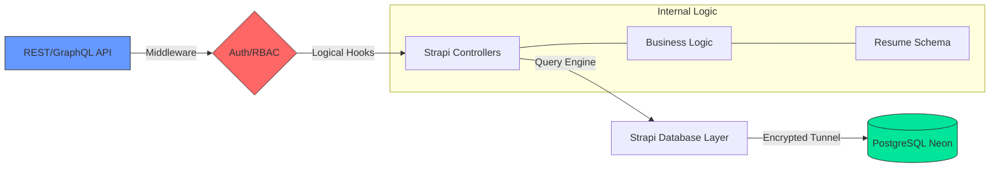

# ⚙️ AI Resume Builder: The Control Room (Backend)

<div align="center">


Handling the logic, orchestration, and persistence for the [AI Resume Builder Frontend](https://github.com/shekhawatmuskan/ai-resume-builder).

</div>

---

## 🌟 The Core Mission

While the frontend provides the canvas, **ai-resume-admin** is the "Control Room". It serves as a headless power plant, built with **Strapi 5**, that manages complex user permissions, resume data structures, and acts as the secure bridge between the user's interface and the **Neon PostgreSQL** database.

### ⚡ Engine Capabilities

- **🔐 Robust Data Shield:** Centralized authentication and permission management via Strapi's Users-Permissions plugin.
- **📦 Structured Content Types:** Dynamic schemas for Resumes, Experience, Education, and Skills, optimized for rapid API delivery.
- **🚀 Performance-First Architecture:** Built with TypeScript for type safety and integrated with Neon for serverless database scalability.
- **🛠️ Admin Command Center:** A powerful UI for managing user data, monitoring activity, and fine-tuning content without touching code.

---

## 🏗️ Backend Flow

How data migrates from user intent to secure persistence.



---

## 🔌 Ecosystem Role

This repository is strictly the **Backend Core**. It is designed to work in tandem with:

- 🎨 **[Frontend Repository](https://github.com/shekhawatmuskan/ai-resume-builder):** The React-based consumer of this API.
- 🧪 **[Gemini AI Engine]:** Orchestrated via the frontend, with results persisted back here.

---

## 🛠️ The Tech Forge

| Tech         | Version    | Role                             |
| :----------- | :--------- | :------------------------------- |
| **Strapi**   | 5.x (Beta) | Headless CMS & API Orchestration |
| **Database** | PostgreSQL | Relational data persistence      |
| **Host**     | Neon       | Serverless DB infrastructure     |
| **Language** | TypeScript | High-reliability logic & typing  |

---

## 🚀 Booting the Core

<details>
<summary><b>1. Calibrate Environment</b></summary>

Copy `.env.example` to `.env` and fill in your Neon and Strapi keys:

```env
DATABASE_URL=...
STRAPI_API_TOKEN_SALT=...
ADMIN_JWT_SECRET=...
JWT_SECRET=...
```

</details>

<details>
<summary><b>2. Install Dependencies</b></summary>

```bash
npm install
```

</details>

<details open>
<summary><b>3. Launch Development Mode</b></summary>

```bash
npm run develop


```
